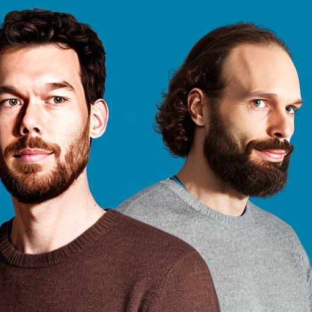

# NyxAI

**NyxAI is a Swiss startup building state of the art tools for image generation**

**Francophone?** Cette vidéo présente notre plateforme dreamlook.ai, qui vous permets de créer des images et d'entrainer des modèles de génération d'images sur-mesure:

[video fr]

Our main product, dreamlook.ai, allows businesses to create images and to train custom image generation models. Check out this video to learn more:

[video en]

## Our products & research

### ⚡️ dreamlook.ai

> Finetune Stable Diffusion in Minutes

https://dreamlook.ai

### diffusion.gg

> Create beautiful art from text

https://www.diffusion.gg/

### Nyx.gallery

> AI-generated photorealistic images

https://nyx.gallery

### Research project: "This Food Does Not Exist"

> Training StyleGAN2 on TPUs in JAX

https://nyx-ai.github.io/stylegan2-flax-tpu

## The team

*AI-generated image of the team*

### Martin Müller

- [Website](https://masterscrat.github.io)
- [LinkedIn](https://www.linkedin.com/in/florianlaurent/)
- [Twitter](https://twitter.com/marmuel_)
- [GitHub](https://twitter.com/masterscrat)

### Florian Laurent

- [Website](https://www.martinmuller.me/)
- [LinkedIn](https://www.linkedin.com/in/martin-m%C3%BCller-053184125/)
- [Twitter](https://twitter.com/marmuel_)
- [GitHub](https://github.com/mar-muel)

## In the news

- [Three aspiring startups secure capital from the Wingman campus Fund
  ](https://www.startupticker.ch/en/news/three-aspiring-startups-secure-capital-from-the-wingman-campus-fund)
- [FIT Digital boosts GRAPL, NyxAI, HoliYou and Thot
  ](https://www.startupticker.ch/en/news/fit-digital-funding-for-grapl-nyxai-holiyou-and-thot)
- [La Suisse romande, terre fertile pour les start-up spécialisées en intelligence artificielle
  ](https://www.letemps.ch/economie/cyber/suisse-romande-terre-fertile-startup-specialisees-intelligence-artificielle)
